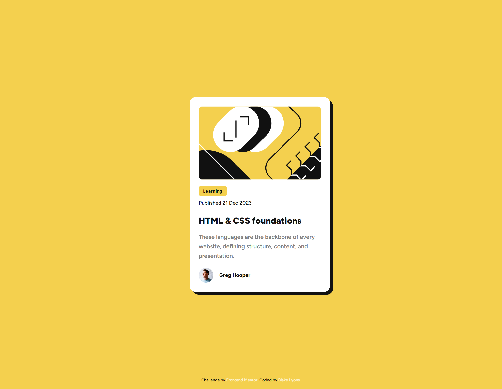

# Frontend Mentor - Blog preview card solution

This is a solution to the [Blog preview card challenge on Frontend Mentor](https://www.frontendmentor.io/challenges/blog-preview-card-ckPaj01IcS). Frontend Mentor challenges help you improve your coding skills by building realistic projects.

## Table of contents

-   [Overview](#overview)
    -   [The challenge](#the-challenge)
    -   [Screenshot](#screenshot)
    -   [Links](#links)
-   [My process](#my-process)
    -   [Built with](#built-with)
    -   [What I learned](#what-i-learned)
-   [Author](#author)

## Overview

### The challenge

Users should be able to:

-   See hover and focus states for all interactive elements on the page

### Screenshot

### Links

-   Solution URL: [https://github.com/blakelyons/blog-preview-card-main](https://github.com/blakelyons/blog-preview-card-main)
-   Live Site URL: [https://blog-preview-card-main-1jp.pages.dev/](https://blog-preview-card-main-1jp.pages.dev/)

## My process

### Built with

-   Semantic HTML5 markup
-   CSS custom properties
-   Flexbox
-   CSS Grid
-   Mobile-first workflow
-   [React](https://reactjs.org/) - JS library
-   [Next.js](https://nextjs.org/) - React framework
-   [Styled Components](https://styled-components.com/) - For styles

**Note: These are just examples. Delete this note and replace the list above with your own choices**

### What I learned

I didn't really learn anything new on this project. This was just something quick I wanted to do because it looked fun.

### Useful resources

n/a

## Author

### Blake Lyons

-   Website - [https://www.blakelyons.com](https://www.blakelyons.com)
-   Frontend Mentor - [@blakelyons](https://www.frontendmentor.io/profile/blakelyons)
-   Twitter - [@blakelyons](https://www.x.com/blakelyons)
